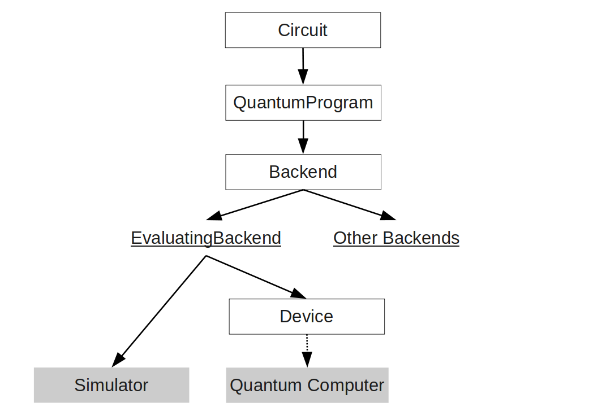

# Introduction

**Welcome to the user documentation for the qoqo/roqoqo quantum computing toolkit.**

This user documentation gives a general overview of the design principles and intended usage scenarios for qoqo and roqoqo. For a detailed documentation of all types and functions see the API-documentation of [roqoqo](https://docs.rs/roqoqo/)
 and [qoqo](https://qoqo.readthedocs.io/en/latest/)

## What are qoqo and roqoqo

The packages qoqo and roqoqo are a pair of quantum computing toolkits  by [HQS Quantum Simulations](https://quantumsimulations.de).

Like many quantum toolkits qoqo and roqoqo are at the core circuit based toolkits. A sequence of operations to be run on a quantum computer are grouped into a quantum circuit.

In the majority of quantum computing applications the output of several quantum circuits needs to be collected and processed using additional classical measurement input to construct a usable measurement result (e.g. when using a quantum computer to simulate physical quantum systems).

qoqo and roqoqo also provide tools to group quantum circuits and measurement input into a QuantumProgram. QuantumPrograms are designed as a high-level interface to quantum computations that can be used similar to standard function calls.
QuantumPrograms accept floating point inputs, can be serialized and only need qoqo/roqoqo and a simulator or hardware backend to be executed.

### What roqoqo/qoqo is:

* A toolkit to represent quantum operations and circuits
* A tool to package quantum circuits and classical information into Quantum Programs
* A way to serialize quantum programs
* A set of optional interfaces to devices, simulators and toolkits (e.g. [qoqo_quest](https://github.com/HQSquantumsimulations/qoqo-quest), [qoqo_mock](https://github.com/HQSquantumsimulations/qoqo_mock), [qoqo_qasm](https://github.com/HQSquantumsimulations/qoqo_qasm))

### What roqoqo/qoqo is **not**:

* A decomposer translating circuits to a specific set of gates
* A quantum circuit optimizer
* A collection of quantum algorithms

### qoqo vs roqoqo

roqoqo is the core implementation of the toolkit. It is written in Rust.
qoqo is the Python interface to roqoqo and implements 

## Components

The schematic overview below shows the interplay of different components in qoqo/roqoqo which are described in the chapters of this documentation.

* A [Circuit](circuits/intro.md) is a an element that includes a sequence of [gate operations](gate_operations.md) applied on the involved qubits.
* A [QuantumProgram](high-level/intro.md) is an object that contains Circuits, Measurements (e.g. [PauliZProduct](high-level/pauliz.md)) and can run on a Backend.
* For each individual hardware or simulator a [Backend](backends.md) can be created, that is either an `EvaluatingBackend` (like `qoqo-quest`) or a non-evaluating backend (like `qoqo_qasm`).
* [Devices](devices.md) can be abstract devices or actual hardware devices.

