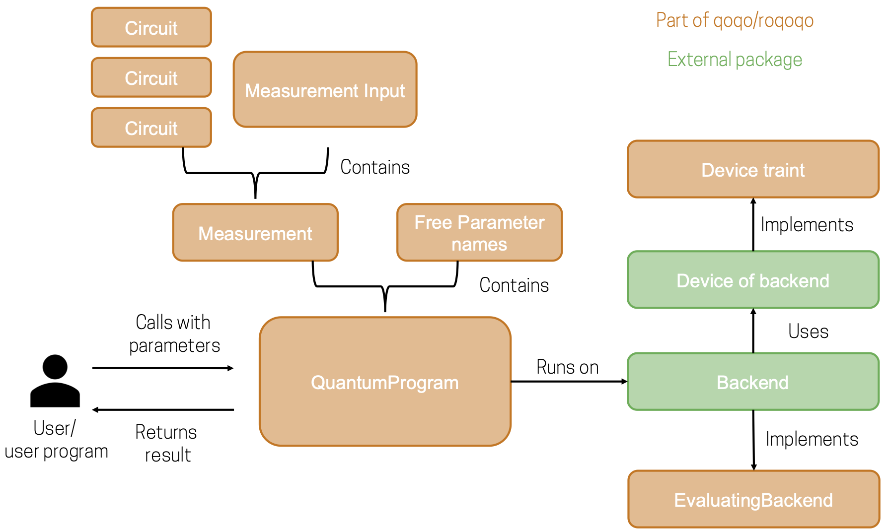
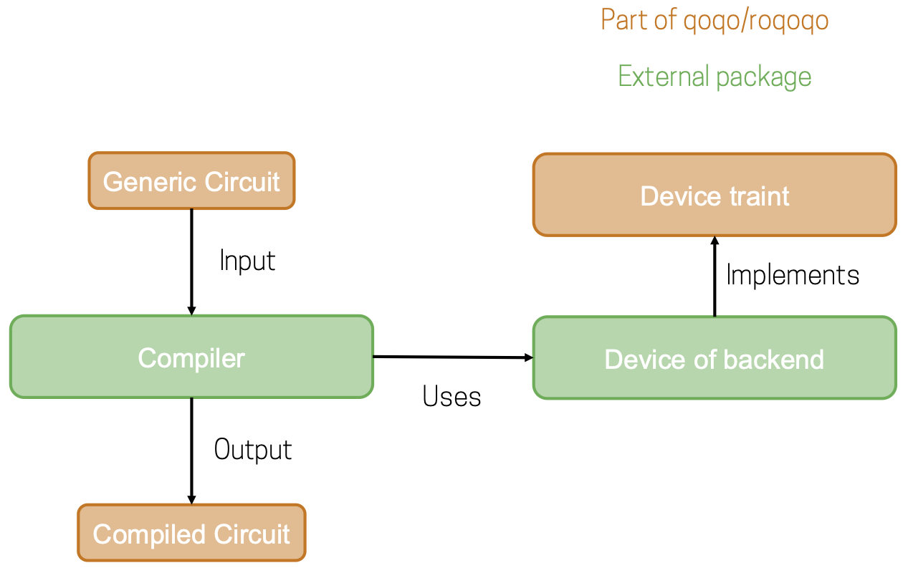

# Introduction

**Welcome to the user documentation for the qoqo/roqoqo quantum computing toolkit.**

This user documentation gives a general overview of the design principles and intended usage scenarios for qoqo and roqoqo. For a detailed documentation of all types and functions see the API-documentation of [roqoqo](https://docs.rs/roqoqo/)
 and [qoqo](https://qoqo.readthedocs.io/en/latest/)

## What are qoqo and roqoqo

The packages qoqo and roqoqo are a pair of quantum computing toolkits  by [HQS Quantum Simulations](https://quantumsimulations.de).

Like many quantum toolkits qoqo and roqoqo are at the core circuit based toolkits. A sequence of operations to be run on a quantum computer are grouped into a quantum circuit.

In the majority of quantum computing applications the output of several quantum circuits needs to be collected and processed using additional classical measurement input to construct a usable measurement result (e.g. when using a quantum computer to simulate physical quantum systems).

qoqo and roqoqo also provide tools to group quantum circuits and measurement input into a QuantumProgram. QuantumPrograms are designed as a high-level interface to quantum computations that can be used similar to standard function calls.
QuantumPrograms accept floating point inputs, can be serialized and only need qoqo/roqoqo and a simulator or hardware backend to be executed.

### What roqoqo/qoqo is

* A toolkit to represent quantum operations and circuits
* A tool to package quantum circuits and classical information into Quantum Programs
* A way to serialize quantum programs
* A set of optional interfaces to devices, simulators and toolkits (e.g. [qoqo_quest](https://github.com/HQSquantumsimulations/qoqo-quest), [qoqo_mock](https://github.com/HQSquantumsimulations/qoqo_mock), [qoqo_qasm](https://github.com/HQSquantumsimulations/qoqo_qasm))

### What roqoqo/qoqo is **not**

* A decomposer translating circuits to a specific set of gates
* A quantum circuit optimizer
* A collection of quantum algorithms

### qoqo vs roqoqo

roqoqo is the core implementation of the toolkit. It is written in Rust.
qoqo is the Python interface to roqoqo and implements

## Architecture

roqoqo has several components:

* Operations and Circuit (see [Quantum Circuits](circuits/intro.md))
* Measurements and QuantumProgram (see [High-Level Interface: Quantum Programs](high-level/intro.md))
* Backends (see [Backends](backends.md))
* Devices (see [Devices](devices.md))

Operations and Circuit can be used to represent single quantum circuits that run on quantum hardware.

Measurements and QuantumProgram combine several Circuits with classical information to provide a high level interface for running quantum programs that yield an immediately usable result.

To execute quantum circuits or quantum programs a backend connecting to quantum hardware or a simulator is required.
qoqo/roqoqo themselves do not implement these backends. To minimize dependencies backends are implemented in separate packages (e.g. `qoqo-quest`).
In the `backends` module roqoqo provides an interface description for backends with the `EvaluatingBackend` rust trait.

When compiling quantum circuits it is often necessary to know the topology of a targeted quantum device. Device properties can also be used by backends, for example to accurately simulate a given quantum device.
At the moment qoqo/roqoqo does not implement generic devices but defines an interface for obtaining the device topology and the noise properties. The interface is defined by roqoqos `Device` trait.

The following schematic shows how the different components are related when running a quantum program:

The circuit compilation usecases can be visualized in a similar way:

